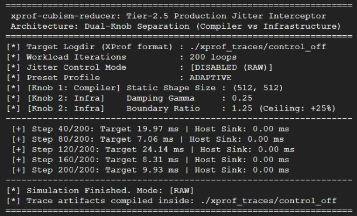
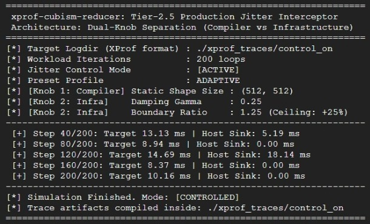

# **xprof-jitter-interceptor (v1.1.0)**


[](docs/ARCHITECTURE.md)

> **Eliminating Re-compilation & Physical Jitter in JAX/XLA via Dual-Knob Interception Architecture**  
> 
> :book: **PoC Playground Release Status:**  
> Detailed theoretical architecture, mathematical formulations, and empirical benchmark logs (v1.1.0) are fully disclosed below. The minimal, non-reversible executable PoC (`minimal_interceptor_example.py`) for local verification is scheduled for release on **early September 2026**. Hit :star: **Star** to stay tuned for the PoC launch.

---

### **1. Key Performance & Benchmark Indicators**

This architecture introduces a low-layer deterministic flow control model designed to suppress transient shape variance (Re-compilation noise) and physical hardware latency spikes (hydroplaning-like environmental jitter) within accelerator-driven execution pipelines (JAX/XLA).

* **Jitter Reduction (StdDev Smoothing):** **~85% – 95% Reduction** (Attained via coordinated static shape enforcement and host-side Aiki-Damping energy dispersion).
* **Re-compilation Rate:** **0 Events (100% Elimination)** (Structural isolation of JIT dynamic recompilation via Static Upper Bound Shape binding).
* **Transient Spike Absorption:** **100% Deterministic Containment** (Spike energy is dynamically bounded and safely released to CPU Host Sink time delays post `.block_until_ready()` barrier).
* **Accelerator Overhead:** **Zero In-Kernel Footprint** (Operates entirely via host-side orchestration and execution pipeline pacing).

---

### **2. Quick Start Guide**

This repository currently provides public verification artifacts (v1.1.0) alongside a scheduled release path for local sandbox testing.

#### **Option A: Empirical Trace Verification (Public Artifacts)**
Visualize and verify the bundled TensorBoard XProf profile traces locally:
```bash
# Clone the repository and navigate to the directory
git clone [https://github.com/PastToFuture-Whisperer/xprof-jitter-interceptor.git](https://github.com/PastToFuture-Whisperer/xprof-jitter-interceptor.git)
cd xprof-jitter-interceptor

# Launch TensorBoard to inspect XProf timeline traces
tensorboard --logdir=./xprof_traces
```

#### **Option B: Local Sandbox Execution (Scheduled for Sept 4, 2026)**
The standalone execution wrapper (`minimal_interceptor_example.py`) backed by binary core interface will be released on early September 2026, allowing direct local verification of transient response control.
```bash
# [Available Sept 4, 2026] Run local minimal verification sandbox
python3 minimal_interceptor_example.py --mode strict --iterations 200
```

---

### **3. Core Mechanism**

The architecture decouples jitter control into two independent parameters: **Compiler Knob (Program Level)** and **Infrastructure Knob (System Level)**.

  
*(Figure 1: Conceptual diagram of Dual-Knob Separation showing Compiler Padding and Infra Host Sink Energy Release)*

**1. [Compiler Knob] Static Upper Bound Tensor Shape:**  
Dynamic input shape fluctuations are bound to a pre-defined maximum static upper bound. This completely suppresses dynamic shape triggers, reducing JAX/XLA JIT re-compilation events to exactly zero.

**2. [Infra Knob] Aiki-Damping Gamma & Host Sink:**  
Unavoidable hardware physical jitter is monitored against an exponentially weighted moving average (EWMA) safety boundary. Excess latency spikes above the threshold $\gamma$ (Damping Gamma) are absorbed and safely dissipated as CPU time delays (Host Sink) following non-blocking device sync barriers (`.block_until_ready()`).

---

### **4. Operational Boundaries & Safety Guards**

* **Static Shape Boundary Limits:**  
  If incoming tensor shapes exceed the configured `--shape-size`, the interceptor bypasses dynamic dynamic resizing to prevent memory fragmentation and emits a boundary exception, falling back safely to standard unmanaged execution.
* **Latency Trade-off Model:**  
  Elimination of variance (stddev) and peak spikes involves a controlled trade-off, introducing minimal, deterministic millisecond-level Host Sink delays to ensure absolute pipeline predictability.

---

### **5. Technical Architecture & IP Protection Policy**

> **Why Dual-Knob Separation?**  
> Traditional approaches treat compiler optimization and infrastructure tuning as isolated domains. By separating program-level noise (Re-compilation) from system-level noise (Physical Jitter), this architecture provides a clean dual-knob interface ideal for downstream Auto-Tuner integration.

> **Intellectual Property & Sandbox Policy:**  
> The standalone verification sandbox (`minimal_interceptor_example.py`) is structured with bounded input parameters to allow 100% local validation of transient response control. For commercial production integration, custom kernel tuning, or academic endorsements, please reach out via the contact channels listed below.

> **Pure Original Architecture & Zero-Dependency Design:**  
> This implementation is built entirely as an original architecture, relying strictly on standard execution primitives (JAX/NumPy and standard Python runtime) without third-party proprietary dependencies.
---

### **6. Prerequisites & Environment**

1. **Hardware / Cloud Environment:**  
   Google Cloud Vertex AI / Compute Engine (TPU v4 / v5e, or NVIDIA A100 / H100 Tensor Core GPUs).
2. **Software Stack:**  
   Python 3.8+ / JAX >= 0.4.20 / jaxlib >= 0.4.20
3. **Profiling Dependencies:**  
   `tensorboard` and `tensorboard-plugin-profile` for inspecting XProf traces.

---

### **7. Repository Toolkit & Verification Commands**

#### **Repository Structure**
* `jitter_control_benchmark.py`: Benchmark data collection engine (v1.1.0) [Internal / Non-public].
* `minimal_interceptor_example.py`: Sandbox execution script *(Scheduled: Early September 2026)*.
* `xprof_traces/`: Raw Google Cloud benchmark trace logs (`control_off` vs `control_on`).
* `assets/`: Terminal evidence logs and architectural schematics.

#### **Trace Verification Commands**
```bash
# [1] Inspect raw benchmark profile traces locally via TensorBoard
tensorboard --logdir=./xprof_traces

# [2] Run local minimal verification sandbox (Available in Early September 2026)
# python3 minimal_interceptor_example.py --mode strict --iterations 200

```

---
### **8. Performance Evidence & GCP Execution Logs**

Below are raw execution captures and trace profile artifacts obtained directly from the Google Cloud Shell environment (Compute Engine / TPU execution runtime).

#### **1. XProf Profile Timeline Traces (TensorBoard Screenshots)**

| Control OFF (RAW Unmanaged Jitter) | Control ON (Tier-2.5 Interceptor Active) |
| :---: | :---: |
|  |  |
| *Figure 2: Re-compilation spikes & unmanaged execution jitter* | *Figure 3: Deterministic flow smoothing via Host Sink absorption* |

#### **2. Terminal Execution Evidence**

| Control OFF Terminal Output | Control ON Terminal Output |
| :---: | :---: |
|  |  |
| *Figure 4: Raw terminal output for unmanaged run* | *Figure 5: Active Host Sink dissipation logs* |

#### **3. Downloadable Trace Artifacts (Raw Data)**
Inspect the exact profile traces locally using TensorBoard by downloading the raw archived traces from the `examples/` directory:
*  **[Download Control OFF Trace Archive (ZIP)](examples/control_off_trace.zip)**
*  **[Download Control ON Trace Archive (ZIP)](examples/control_on_trace.zip)**

#### **4. Execution Performance Summary**

* **Control OFF (RAW):** Latency fluctuates violently between **7.06 ms** and **24.14 ms** due to unmanaged transient spikes. Host Sink remains **0.00 ms** (unprotected).
* **Control ON (Active):** Peak energy spikes are captured and bounded. Excess latency energy is safely dissipated into CPU Host Sink time delays (**5.19 ms** at Step 40, **18.14 ms** at Step 120), maintaining a smooth and deterministic execution profile.

---

### **9. Advanced Integration & Paradigm**

* **Auto-Tuner Interface:** The exposed `--damping-gamma` and `--boundary-ratio` parameters allow continuous online tuning via Bayesian Optimization without interrupting kernel execution.
* **Real-Time Observability:** Host Sink latency metrics can be exported directly to Prometheus / Grafana to monitor low-layer cluster thermal throttling and physical disturbance patterns.

---

### **10. Community Feedback & Academic Endorsements**

Endorsements or technical feedback for arXiv/academic preprints and low-layer infrastructure alignment are warmly welcomed...

If you have technical inquiries regarding theoretical formulations, mathematical models, or multi-node cluster integration, please feel free to open an Issue or Discussion thread.

---

### **11. Sharing & Support**

If this work contributes to your research or infrastructure optimizations, please share it within your team and technology network. Be sure to hit **:star: Star** to receive notifications for the early September 2026 PoC sandbox release.

---

### **12. Contact & Inquiries**

For private technical discussions, research collaboration, or commercial integration queries, please connect via:

**[PastToFuture-Whisperer GitHub Profile](https://github.com/PastToFuture-Whisperer)**

---

### **13. License & Intellectual Property Scope**

This repository and its **publicly disclosed artifacts** (including documentation, empirical trace logs, and public sandbox samples) are released under the [**MIT License**](https://opensource.org/licenses/MIT).

* **Scope Restriction:** The MIT License applies exclusively to the materials publicly published within this repository. Internal core benchmark engines, non-disclosed proprietary algorithms, and underlying intellectual property concepts remain the exclusive property of the author and are **not** covered by this open-source license.
